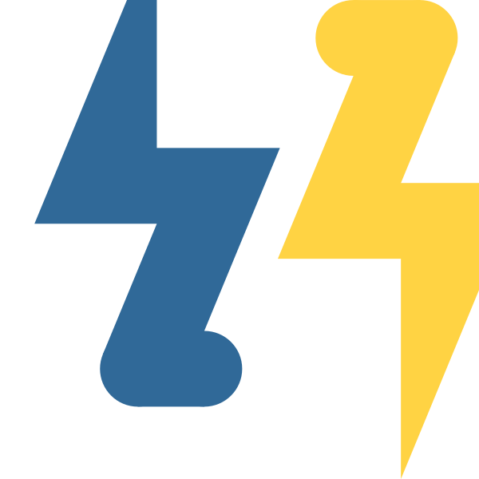

#  ngboost-lightning

**Natural gradient boosting for probabilistic prediction, powered by LightGBM.**

ngboost-lightning reimplements the [NGBoost](https://github.com/stanfordmlgroup/ngboost) algorithm using [LightGBM](https://github.com/lightgbm-org/LightGBM)'s histogram-based tree building instead of scikit-learn's exact splitter. The algorithm is structurally identical — K independent boosters (one per distribution parameter), natural gradients, line search — but training is **up to 13x faster** on larger datasets.

## Key Features

- **Full predictive distributions** — predict means, variances, quantiles, and CDFs, not just point estimates
- **12 distributions** — Normal, LogNormal, Exponential, Gamma, Poisson, Laplace, StudentT, Weibull, HalfNormal, Cauchy, Bernoulli, Categorical
- **Survival analysis** — right-censored data with censored log-likelihood
- **Two scoring rules** — LogScore (MLE) and CRPS for calibration-focused training
- **sklearn compatible** — pipelines, cross-validation, `get_params`/`set_params`
- **LightGBM speed** — histogram-based splitting, 5-13x faster than NGBoost on 10k+ samples

## Quick Example

```python
from ngboost_lightning import LightningBoostRegressor

reg = LightningBoostRegressor(n_estimators=200, learning_rate=0.05)
reg.fit(X_train, y_train)

# Full predictive distribution
dist = reg.pred_dist(X_test)
dist.mean()       # conditional mean
dist.ppf(0.05)    # 5th percentile
dist.ppf(0.95)    # 95th percentile
```

## Next Steps

- [Installation](getting-started/installation.md) — install with pip or uv
- [Quickstart](getting-started/quickstart.md) — fit your first model in 5 minutes
- [Distributions](user-guide/distributions.md) — choose the right distribution for your data
- [API Reference](api/SUMMARY.md) — full auto-generated reference
